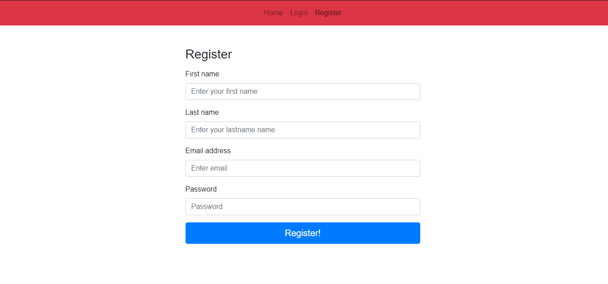
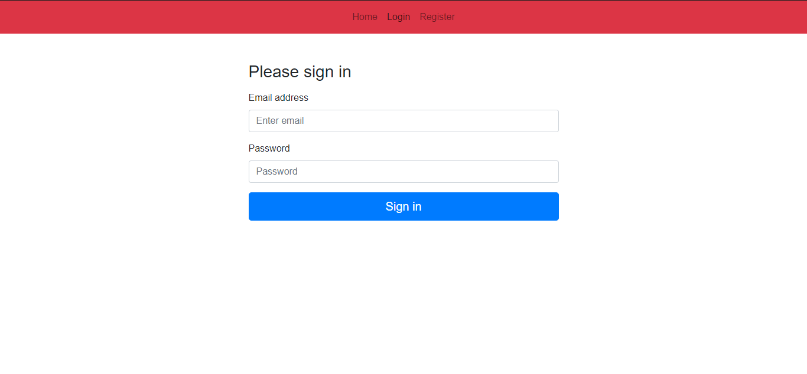

#Instructions
1)Install the node modules individually in main directory and client folder by using npm install.
2)Then first start the server by using npm start.
3)After that change the directory main directory to client directory by using cd command.
4)Again start with npm start.

Now, We are ready to achieve our goal.

